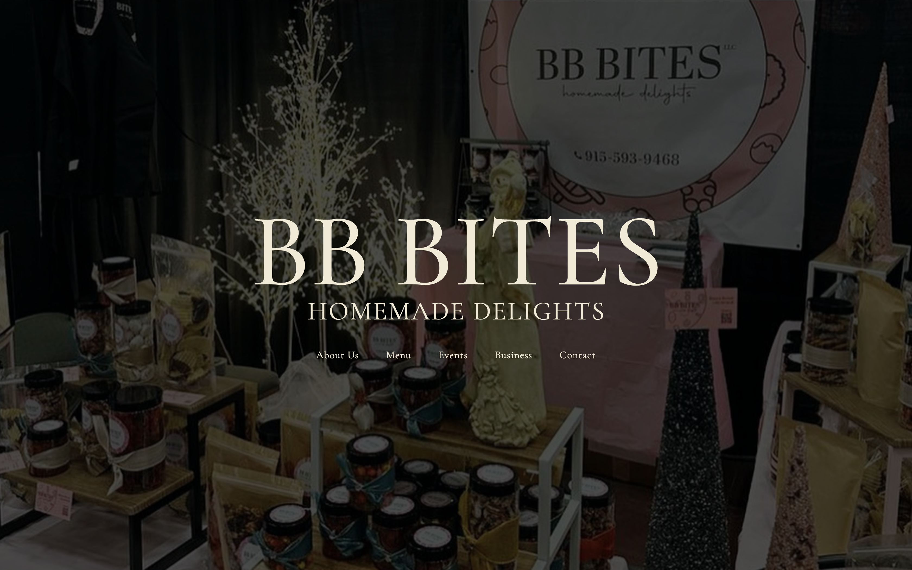
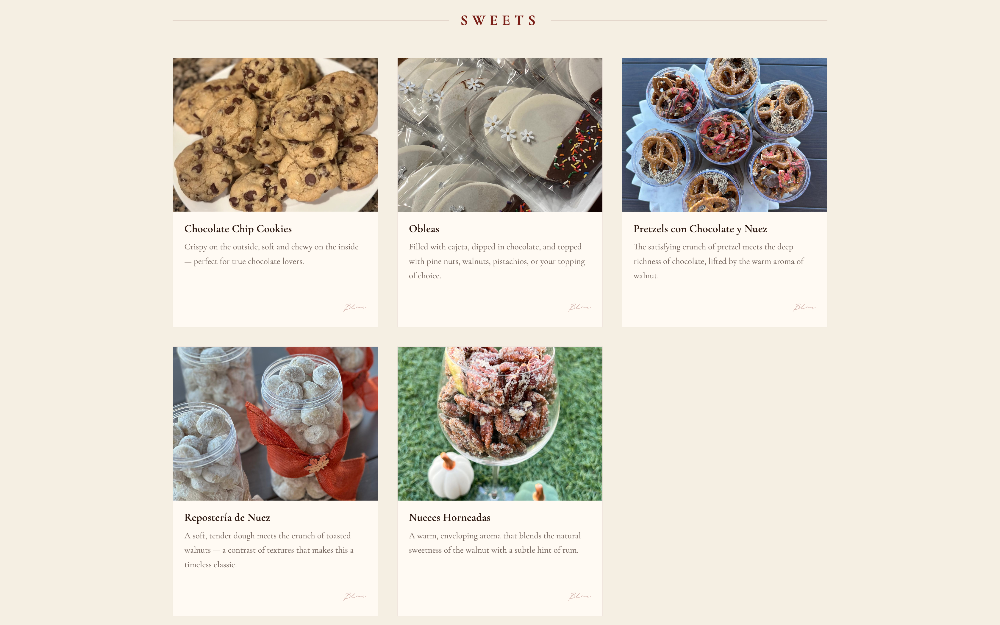
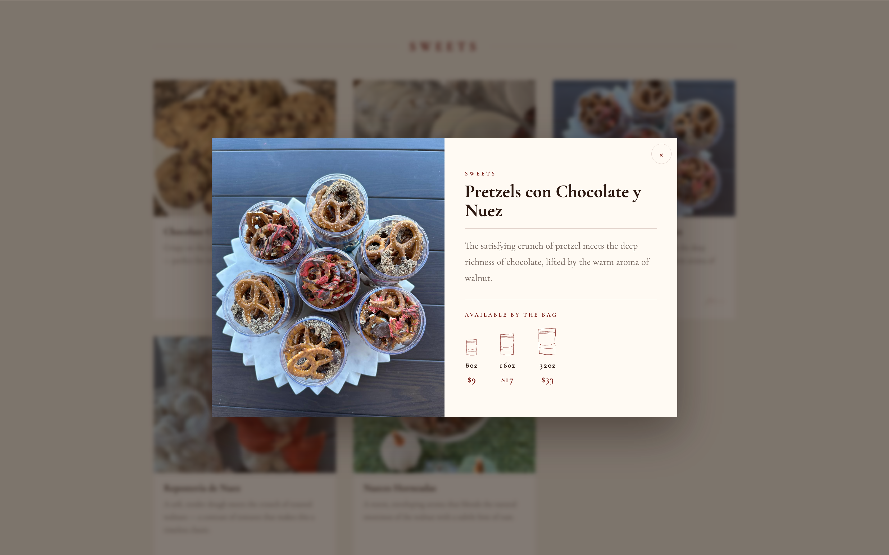
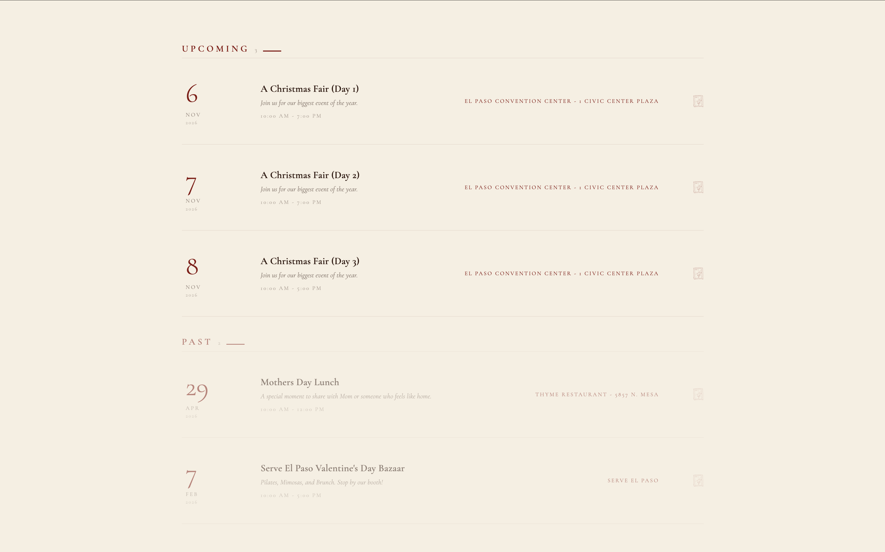
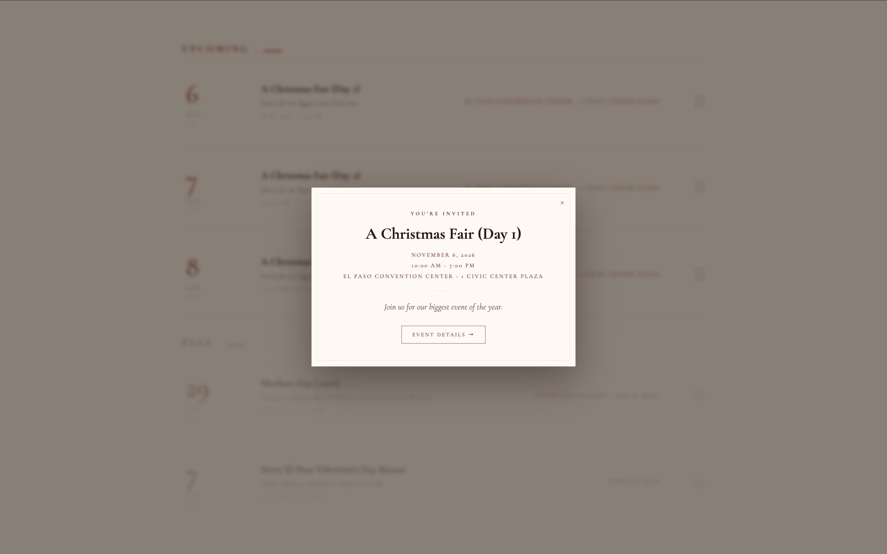
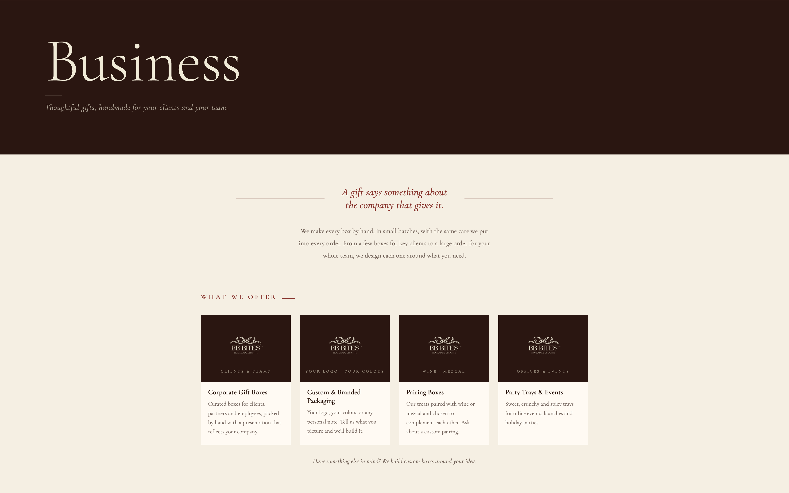
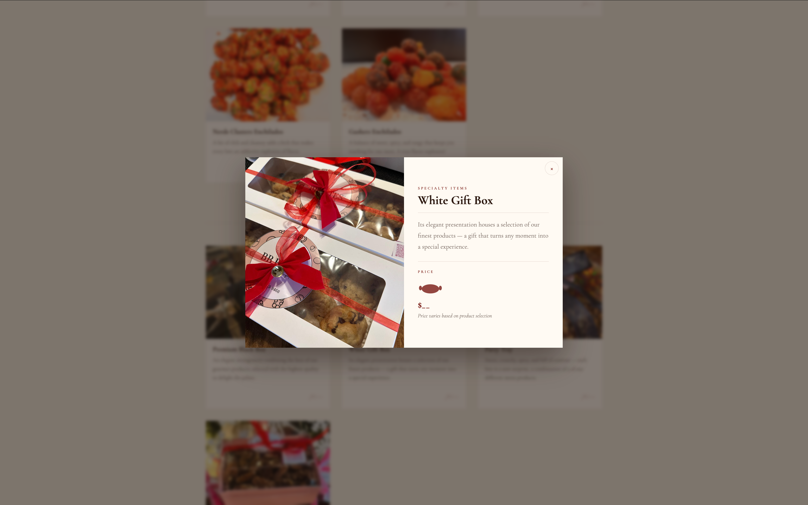

# BB Bites — Website

**[Live site →](https://bb-bites.com)**

A custom website I designed and built for BB Bites, a home-based handmade treats business in El Paso, Texas. It replaces the business's original Square site with a multi-page site featuring a product catalog, an events system, and a business page. The Square site limited both what the site could do and how it could look, so a custom build gave us full control over its features and design.

  

## What's on the site
- **Home, About, Menu, Events, Business, and Contact** pages, each built with its purpose in mind rather than one generic template reused everywhere.

- **An Interactive Product Catalog** where each item opens into a detail view with its own pricing, built on a small shared pricing system rather than a hardcoded price per product (more on that below).

  
  &nbsp;
  

- **An Events Section** that automatically sorts listings into "upcoming" and "past" based on the current date. Each event opens into an "invitation" that optionally includes a small photo gallery or an outside link with more information about events BB Bites is taking part in.

  
  &nbsp;
  

- **A Corporate/Business Page**, built as the final stage before launch, offering a different kind of information (partnerships, bulk and custom orders) without requiring changes to the rest of the site's structure.

  

## Engineering Notes

### Content and code are deliberately separate
BB Bites changes constantly: new products, new events, new photos. I wanted updates to be quick and to never require touching code. So all the content (menu items, events, prices, photos, business offerings) lives in small JSON files, and the HTML/CSS/JS reads those files and renders the site from them. Adding a product or event just means adding an entry.

### A small pricing system, not hardcoded prices
Several products share the same pricing shape (say, three sizes with three prices) even though the actual numbers differ. Rather than hardcoding a price block into every product, I split this into two layers: a format — the layout logic, e.g. "three graduated sizes" vs. "one fixed price" — which is code, and a preset — the actual data, which sizes, which prices — which lives in JSON. Multiple products can point at the same preset, so correcting a price in one place updates every product using it. The fixed format currently powers products whose price depends on the customer's choices (shown as a placeholder with a short note), but it's ready for a true single-price product whenever one comes along, and adding a new pricing style later doesn't require touching the display logic at all.

  
  &nbsp;
  

### Built to Grow Incrementally
I built the site in stages rather than all at once: the menu gained a product-detail system, the events page later picked up its upcoming/past logic and invitation popups, and the business/corporate page came last, just before launch. Each one slotted into the same JSON-driven content pattern without restructuring what came before, which is the real payoff of that early architecture decision.

## Future Work
Right now, content updates go through me. Because everything already lives in structured JSON, a natural next step is a simple owner-facing dashboard that edits those files directly, so the business can update its menu and events on its own.

## Stack
Plain HTML, CSS, and JavaScript. The content is driven by small JSON files fetched at runtime. There is no framework, no build step, and no dependencies. It has been deployed as a static site on Netlify.

## Why there's no code here
This is a live, active client project, and its repository contains the business's real content and day-to-day operational details, so the source stays private. This repository is shared with the owner's permission to describe the engineering work and link to the result.